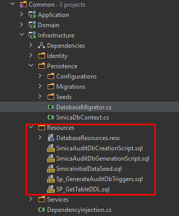

##Scripts for creating audit database for an existing database.
- Scripts are written in MSSQL language.
- Seed code snippet is in C# Asp.NET Core 5.

###Requirement:

Create an Audit database that stores all the data that was inserted/deleted/modified in a main Database.\n

###Logic: 
1) Create an Audit database if it doesn't exist\n
2) Create a script that would get the DDL code of each table from the main database.\n
    - DDL script will be a stored procedure and will be in the main database.\n
3) Create triggers script that will be stored in the main database in each table, and will be auto regenerated once the ddl code is changed and the seed data is executed. \n
4) Create the main script that will contain all the logic for generating audit tables, creating or updating triggers.

###Note:

Once the ddl code of the table is changed in Main database, the table in Audit database will be renamed like(tablename + currentDate), \n
and a new table will be created in Audit database with the tablename.

All the scripts in my project are stored in Resources (.rsx) file ans an .SQL file script.
and are executed in the Seed data that is in project.

